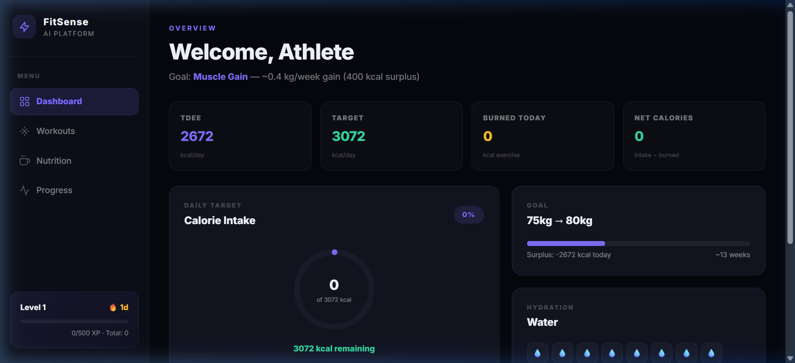
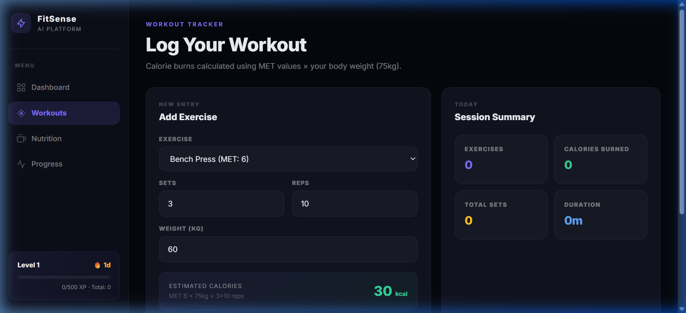
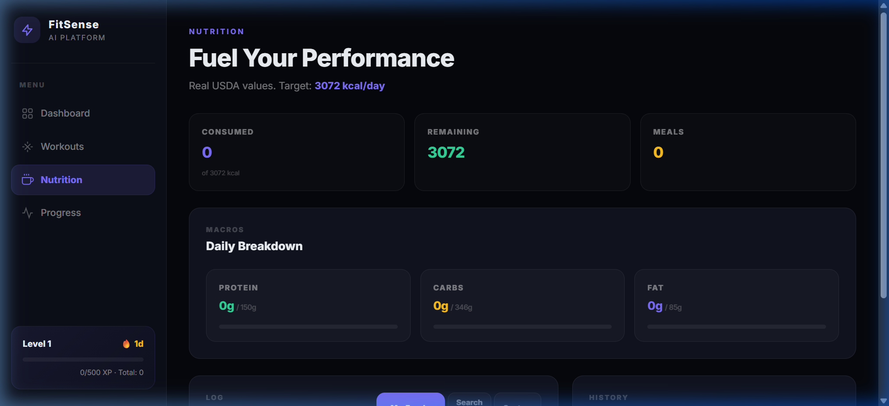
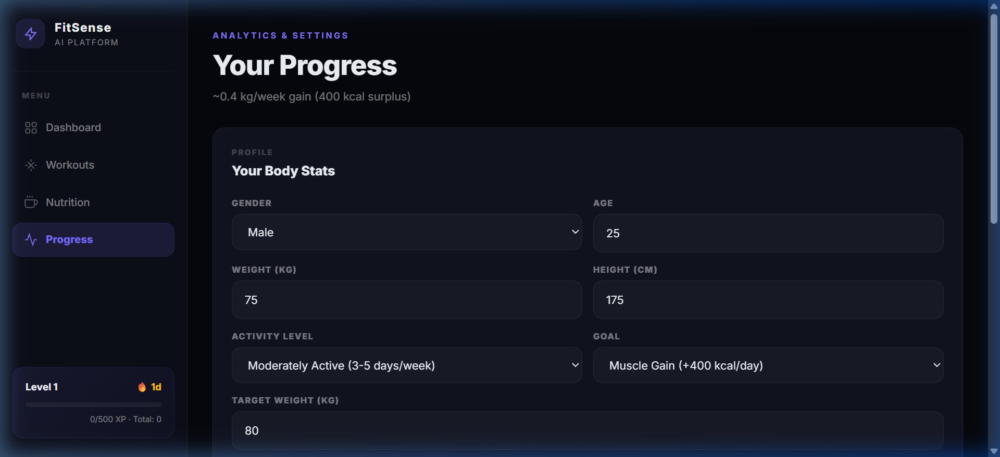

# ⚡ FitSense AI — All-in-One Fitness Platform

A premium, AI-powered fitness management platform built with React, TypeScript, and Zustand. Track workouts, monitor nutrition with real USDA data, visualize progress, and crush your fitness goals — all in one sleek interface.



---

## 🎯 Features

### 📊 Smart Dashboard
- **TDEE Calculator** — Real-time Total Daily Energy Expenditure using the Mifflin-St Jeor equation
- **Calorie Target** — Automatic daily calorie targets based on your goal (fat loss / maintain / muscle gain)
- **Net Calorie Balance** — Track calories consumed vs burned in real-time
- **Weight Goal Tracking** — Visual progress from current weight → target weight with estimated weeks to goal
- **Hydration Tracker** — Log water intake throughout the day

### 🏋️ Workout Tracker
- **25+ Exercises** with real MET (Metabolic Equivalent of Task) values from the Compendium of Physical Activities
- **Accurate Calorie Burn** — Calculated using `MET × body weight (kg) × duration`
- **Smart Exercise Modes** — Automatically switches between strength (sets/reps) and cardio (duration) inputs
- **Live Calorie Estimate** — See estimated burn update as you adjust sets, reps, or duration
- **Categorized Exercises** — Strength, Cardio, Core, HIIT, Flexibility

### 🥗 Nutrition Tracker
- **32+ Foods** with real nutritional values sourced from USDA database
- **Searchable Food Database** — Search "eggs" and get: 155 kcal, 13g protein, 1.1g carbs, 11g fat
- **Saved Foods (My Foods)** — Save frequently eaten foods for quick one-tap logging
- **Custom Entry** — Log any meal with manual macro input
- **Serving Multiplier** — Adjust portions (0.5x, 1x, 2x, etc.) with auto-calculated macros
- **Macro Tracking** — Protein, Carbs, Fat progress bars with personalized daily targets
  - Protein: 2g/kg body weight (muscle gain) or 1.6g/kg (maintenance)
  - Carbs: 45% of daily calorie target
  - Fat: 25% of daily calorie target

### 📈 Progress & Analytics
- **Weekly Charts** — Canvas-rendered bar charts for calories consumed and workout sessions
- **Editable User Profile** — Change age, weight, height, gender, activity level — all calculations update instantly
- **BMR / TDEE / Target** — See exactly how your numbers are calculated
- **Gamification** — XP system with leveling (Level = XP ÷ 500 + 1)
  - +50 XP per workout logged
  - +10 XP per meal logged
  - +5 XP per glass of water

---

## 📸 Interface Screenshots

### Dashboard

> TDEE calculation, calorie ring, weight goal tracking, water tracker, recent workouts

### Workouts

> MET-based calorie burn calculator, categorized exercises, session summary, workout log

### Nutrition

> USDA food database search, saved foods, macro breakdown with progress bars, meal history

### Progress

> Editable profile, BMR/TDEE stats, level progress bar, weekly charts

---

## 🏗️ Tech Stack

| Layer | Technology |
|-------|-----------|
| **Framework** | React 18 + TypeScript |
| **Build Tool** | Vite 5 |
| **State Management** | Zustand |
| **Styling** | Tailwind CSS + Custom CSS variables |
| **Charts** | Canvas API (zero dependencies) |
| **Font** | Inter (Google Fonts) |
| **Architecture** | Component-based SPA with sidebar navigation |

---

## 📁 Project Structure

```
fitsense-ai/
├── frontend/
│   ├── index.html                  # Entry HTML
│   ├── package.json                # Dependencies
│   ├── vite.config.ts              # Vite configuration
│   ├── tsconfig.json               # TypeScript config
│   └── src/
│       ├── main.tsx                # React mount point
│       ├── App.tsx                 # Root component with sidebar navigation
│       ├── stores/
│       │   └── fitnessStore.ts     # Zustand global state
│       ├── data/
│       │   └── fitnessData.ts      # Food DB, exercise MET values, TDEE formulas
│       ├── components/
│       │   ├── Dashboard.tsx       # Overview with calorie ring & stats
│       │   ├── Workouts.tsx        # Exercise logger with MET calculations
│       │   ├── Nutrition.tsx       # Food search, saved foods, meal logger
│       │   └── Progress.tsx        # Charts, profile editor, level system
│       └── styles/
│           └── global.css          # Design system & layout CSS
├── screenshots/                    # UI screenshots for documentation
└── README.md                       # This file
```

---

## 🚀 Getting Started

### Prerequisites
- **Node.js** ≥ 18
- **npm** ≥ 9

### Local Development

```bash
# Clone the repository
git clone https://github.com/kamesh63/Agentic-Permier-League-2.git
cd Agentic-Permier-League-2/fitsense-ai

# Install dependencies
cd frontend
npm install

# Start development server
npm run dev
```

The app will be available at **http://localhost:5173/**

### Production Build

```bash
cd frontend
npm run build
```

The build output will be in `frontend/dist/`.

---

## ☁️ Google Cloud Deployment

### Option 1: Cloud Run (Recommended)

1. **Create a Dockerfile** in `frontend/`:
```dockerfile
FROM node:18-alpine AS build
WORKDIR /app
COPY package*.json ./
RUN npm ci
COPY . .
RUN npm run build

FROM nginx:alpine
COPY --from=build /app/dist /usr/share/nginx/html
COPY nginx.conf /etc/nginx/conf.d/default.conf
EXPOSE 8080
CMD ["nginx", "-g", "daemon off;"]
```

2. **Create `nginx.conf`**:
```nginx
server {
    listen 8080;
    root /usr/share/nginx/html;
    index index.html;
    location / {
        try_files $uri $uri/ /index.html;
    }
}
```

3. **Deploy**:
```bash
gcloud run deploy fitsense-ai \
  --source . \
  --port 8080 \
  --allow-unauthenticated \
  --region us-central1
```

### Option 2: Firebase Hosting

```bash
npm install -g firebase-tools
firebase init hosting
npm run build
firebase deploy
```

---

## 🔬 How Calculations Work

### TDEE (Mifflin-St Jeor Equation)
```
Male BMR   = 10 × weight(kg) + 6.25 × height(cm) - 5 × age + 5
Female BMR = 10 × weight(kg) + 6.25 × height(cm) - 5 × age - 161
TDEE = BMR × Activity Multiplier
```

| Activity Level | Multiplier |
|---------------|-----------|
| Sedentary (desk job) | 1.2 |
| Lightly Active (1-3 days/week) | 1.375 |
| Moderately Active (3-5 days/week) | 1.55 |
| Very Active (6-7 days/week) | 1.725 |
| Athlete (2x/day) | 1.9 |

### Calorie Targets
- **Fat Loss**: TDEE - 500 kcal/day (~0.5 kg/week loss)
- **Muscle Gain**: TDEE + 400 kcal/day (~0.4 kg/week gain)
- **Maintain**: TDEE

### Exercise Calorie Burn (MET Method)
```
Strength: MET × bodyWeight(kg) × ((sets × reps × 4s + rest) / 3600)
Cardio:   MET × bodyWeight(kg) × (duration_minutes / 60)
```

---

## 📄 License

MIT License — free to use, modify, and distribute.

---

Built with ⚡ by FitSense AI Team
